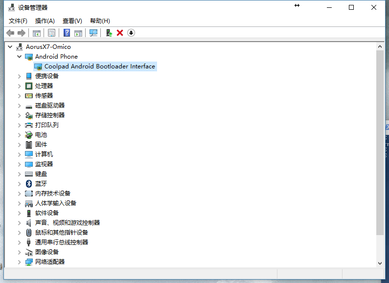
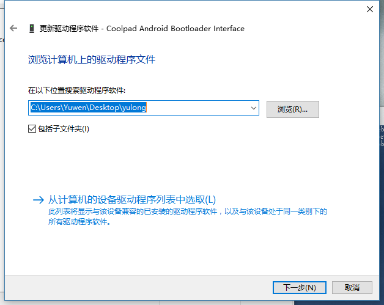
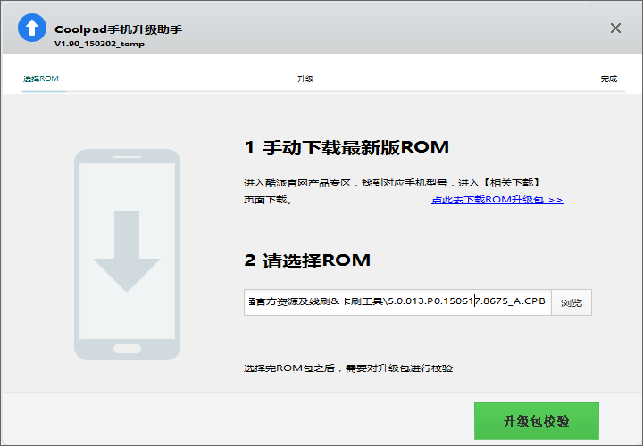
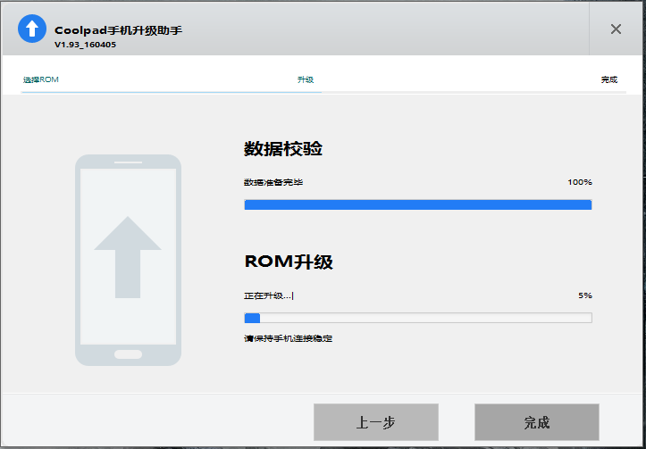
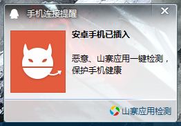

酷派大神F2线刷教程
=================
## 1.下载必要文件
```
链接: http://pan.baidu.com/s/1nuP2Xol 密码: ycvi
```
## 2.安装手机驱动
解压缩```驱动.zip```，安装```setup.exe```。
安装完成后手机进入```fastboot```模式。
将手机连接电脑，打开设备管理器



如果手机显示是这样的表示驱动安装正常
如果不是，那请选中当前显示的设备并右键打开```更新驱动程序软件```-->```浏览计算机已查找驱动程序软件```
选中刚刚```驱动.zip```里解压出来的```yulong```文件夹



点击下一步即可更新成功
## 3.安装CDA线刷工具
解压```CDA.zip```，安装里面的程序
## 4.开始刷机
手机进入```fastboot```模式
解压```5.0.013.P0.150617.8675_A.rar```，得到```5.0.013.P0.150617.8675_A.CPB```
打开CDA并选中```5.0.013.P0.150617.8675_A.CPB```所在的路径



点击```升级包校验```待升级包校验完成后会自动刷机



## 一些额外的注意事项
如果你安装了QQ，并且是比较新的版本，如果在手机连接电脑并进入```fastboot```模式后弹出这样的提示



请完全退出```QQ```后再运行```CDA```
否则```CDA```会提示无法刷机

PS:这是我在测试发现的，记得在教程的右上角给我加```star```
